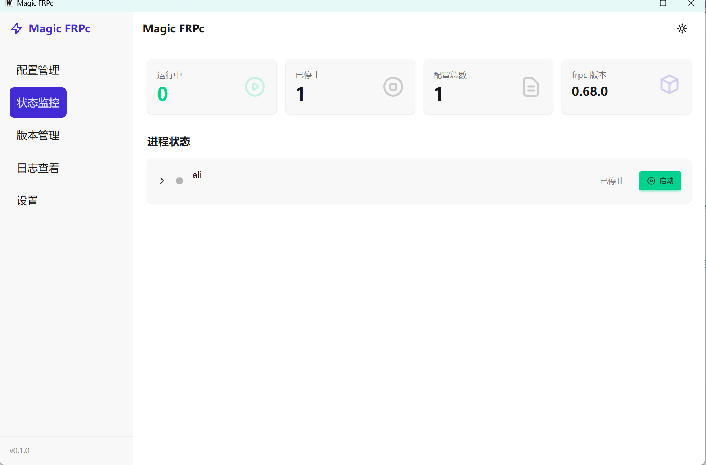

# Magic FRPc

[](https://github.com/magic-frpc/gui/releases)
[](https://github.com/magic-frpc/gui/actions/workflows/release.yml)
[](https://goreportcard.com/report/github.com/magic-frpc/gui)
[](LICENSE)

跨平台 FRP 客户端 GUI 应用，基于 Wails v3 构建，提供直观的 frpc 配置管理和进程控制。



## 功能特性

- **配置管理** - 创建、编辑、导入/导出 frpc 配置文件
- **进程控制** - 启动、停止、重启 frpc 进程，支持多配置并行运行
- **版本管理** - 自动下载、切换 frpc 版本
- **流量监控** - 实时显示代理流量和连接状态
- **系统托盘** - 最小化到托盘，后台运行
- **自动启动** - 支持配置开机自动启动、程序启动自动运行配置
- **国际化** - 中英文界面支持
- **暗黑模式** - 支持浅色/深色/跟随系统主题

## 技术栈

| 组件 | 技术 |
|------|------|
| 后端 | Wails v3 + Go 1.25 |
| 前端 | Svelte 5 + Vite |
| UI | TailwindCSS 4 + daisyUI 5 |
| 数据库 | SQLite (现代c实现) |

## 下载安装

从 [Releases](https://github.com/magic-frpc/gui/releases) 页面下载对应平台的安装包：

| 平台 | 文件 |
|------|------|
| Windows | `magic-frpc-windows-amd64.zip` |
| macOS (Intel) | `magic-frpc-darwin-amd64.tar.gz` |
| macOS (Apple Silicon) | `magic-frpc-darwin-arm64.tar.gz` |
| Linux | `magic-frpc-linux-amd64.tar.gz` |

## 快速开始

### 前置要求

- Go 1.25+
- Node.js 18+
- Wails v3 CLI

### 安装 Wails v3 CLI

```bash
go install github.com/wailsapp/wails/v3/cmd/wails3@latest
```

### 开发模式

```bash
# 克隆项目
git clone https://github.com/magic-frpc/gui.git
cd gui

# 安装依赖
make install-deps

# 启动开发服务器
make dev
```

### 构建

```bash
# 构建当前平台
make build

# 构建 Windows 版本
make build-windows

# 构建 macOS 版本
make build-darwin

# 构建 Linux 版本
make build-linux
```

## 项目结构

```
magic_frpc/
├── frontend/                # 前端代码
│   ├── src/
│   │   ├── views/          # 页面组件
│   │   ├── stores/         # 状态管理
│   │   ├── api/            # API 调用
│   │   ├── locales/        # 国际化
│   │   └── App.vue
│   └── package.json
├── internal/               # Go 内部包
│   ├── app/               # Wails App 绑定
│   ├── config/            # 配置管理
│   ├── frpc/              # frpc 进程管理
│   ├── version/           # frpc 版本管理
│   ├── store/             # SQLite 数据存储
│   ├── startup/           # 开机启动管理
│   └── platform/          # 平台信息
├── pkg/types/             # 公共类型定义
├── main.go                # 应用入口
├── Makefile               # 构建脚本
└── .github/workflows/     # CI/CD 配置
```

## 使用指南

### 1. 设置 frpc 版本

首次使用需要下载 frpc：
1. 进入「版本管理」页面
2. 选择需要的版本点击「下载」
3. 下载完成后点击「设为活动」

### 2. 创建配置

1. 进入「配置管理」页面
2. 点击「新建」创建配置
3. 填写服务器地址、端口、认证令牌
4. 添加代理规则

### 3. 启动连接

1. 选中配置
2. 点击「启动」按钮
3. 在「状态监控」查看运行状态

### 4. 自动启动配置

在配置详情页开启「程序启动时自动运行」，程序启动后会自动启动该配置的 frpc 进程。

## 开发命令

```bash
make help

# 输出:
#   make dev           - 启动开发服务器
#   make build         - 构建应用
#   make build-windows - 构建 Windows 版本
#   make build-darwin  - 构建 macOS 版本
#   make build-linux   - 构建 Linux 版本
#   make clean         - 清理构建产物
#   make install-deps  - 安装依赖
#   make generate      - 生成 Wails 绑定
#   make test          - 运行测试
#   make fmt           - 格式化代码
```

## 许可证

[MIT License](LICENSE)

## 致谢

- [frp](https://github.com/fatedier/frp) - 快速反向代理
- [Wails](https://github.com/wailsapp/wails) - Go + Web 桌面应用框架
- [daisyUI](https://daisyui.com/) - TailwindCSS 组件库